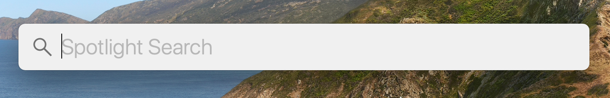
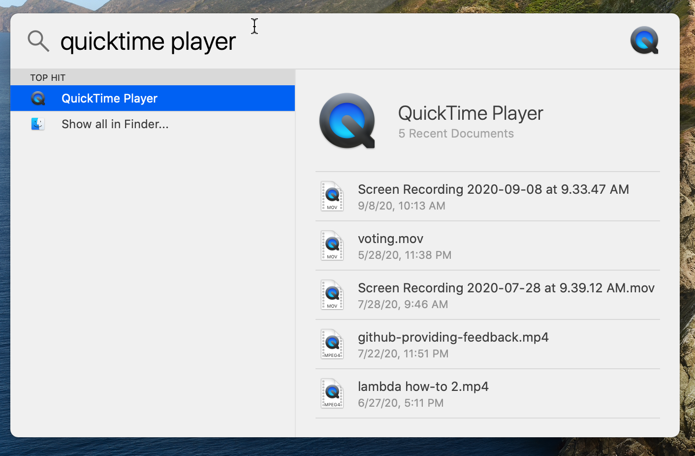
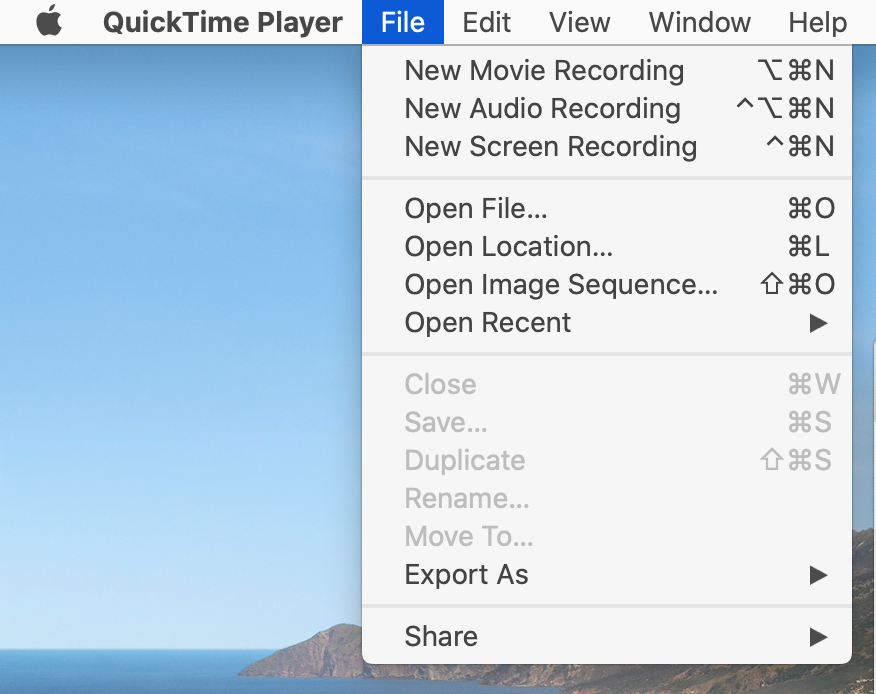
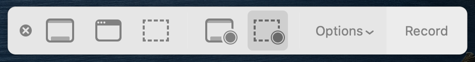
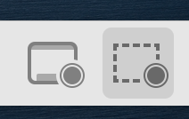
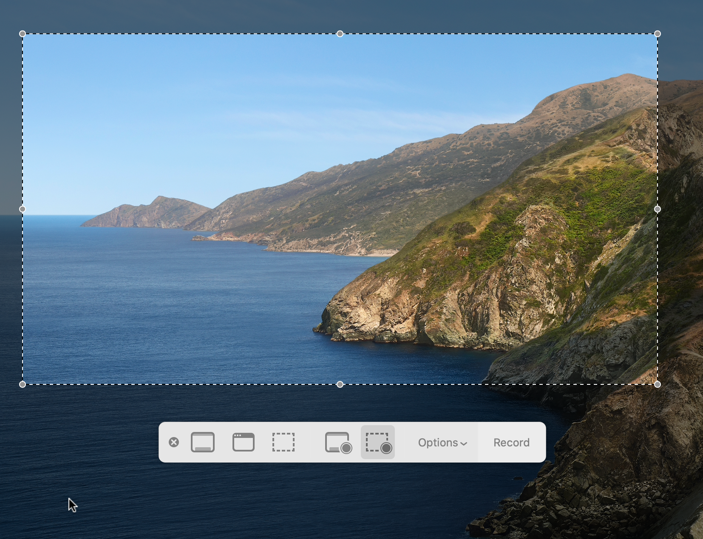
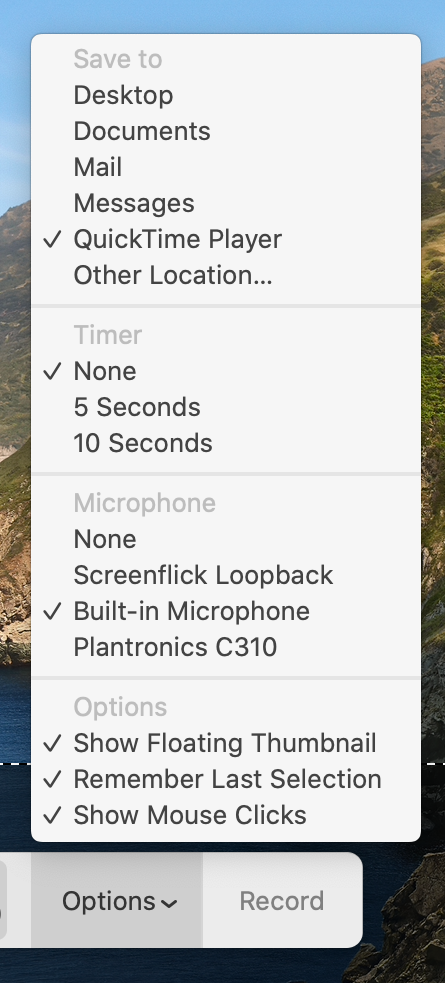

# How to record your screen with Quicktime Player...

...and not having to buy a screencasting program. (As long as you are running a macOS computer.)

## Step One. Open Quicktime Player

1. Type <kbd>command</kbd> + <kbd>space</kbd> (or press the icon with the magnifying glass in the top right corner of your screen):

  

2. That should open the Spotlight search:

  
  
3. Type "Quicktime Player" into the search field, and open the correct application:

  

## Step Two. Start Screen Recording

1. Open the file menu:

  

2. Locate the "settings bar":

  
  
3. Two of the buttons in the "settings bar" will control which part of your screen will be recorded. Select whether you want to record your entire screen (the button on the left) or a portion of the screen (the button on the right).

  
  
4. If you choose to record only a portion of your screen, you can easily use the selection box's different nodes to manipulate the size of it:

  
  
5. Another important menu to pay attention to is the "Options" in the "settings bar":

  
  
  In the first section, you choose where to save your recording. The second section determines the "timer" that will go off when you start recording, to create some buffer. In the "Microphone" section, you can choose which audio source you would like to have in your video (or None, which will not record any audio for your recording). In the final section, you may or may not want to check "Show Mouse Clicks" for the final product showing where you tap your mouse button/trackpad.
